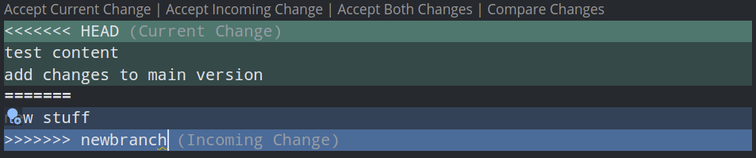

# Merge Conflicts

Merge conflicts happen when you or someone else edits the same file and tries to push into a remote branch. This is common when multiple people are working on the code base. A good way to make sure this does not happen is to `git pull origin main` often if you know others may be working on the same files.

`Note:` Main could be called master if it is an older repository.

## Create and Fix a Merge Conflict

1. For this exercise create a new directory called merge-test in your home directory.

    ```shell
    mkdir git-merge-test
    cd git-merge-test
    ```

2. Initialize the repository with `git init .`

    ```shell
    git init .
    ```

3. Add data to the txt file

    ```shell
    echo "test content" > merge.txt
    ```

4. `git merge` and `git commit` the file

    ```shell
    git add merge.txt
    git commit -am "inital commit"
    [main (root-commit) e3e9921] inital commit
    1 file changed, 1 insertion(+)
    create mode 100644 merge.txt
    ```

5. Create a new branch and change the contents of merge.txt

    ```shell
    git checkout -b newbranch
    echo "new stuff" > merge.txt
    git commit -am 'updated merge.txt for testing'
    ```

6. Checkout main and make a change to the `merge.txt` file

    ```shell
    echo "add changes to main version" >> merge.txt
    git commit -am 'appended merge.txt'
    ```

7. Try and merge `newbranch` into `main`

    ```shell
    git merge newbranch
    ```

    Output:

    ```shell
    git merge newbranch
    Auto-merging merge.txt
    CONFLICT (content): Merge conflict in merge.txt
    Automatic merge failed; fix conflicts and then commit the result.
    ```

8. Lets see what is wrong with `git status`

    ```shell
    git status
    On branch main
    You have unmerged paths.
    (fix conflicts and run "git commit")
    (use "git merge --abort" to abort the merge)

    Unmerged paths:
    (use "git add <file>..." to mark resolution)
            both modified:   merge.txt

    no changes added to commit (use "git add" and/or "git commit -a")
    ```

9. Lets take a look inside merge.txt to see wht the conflict is:

    ```shell
    cat merge.txt
    <<<<<<< HEAD
    test content
    add changes to main version
    =======
    new stuff
    >>>>>>> newbranch
    ```

    These new lines that have been added are "conflict dividers". The ======= line is the "center" of the conflict. All the content between the center and the <<<<<<< HEAD line is content that exists in the current branch master which the HEAD ref is pointing to. Alternatively all content between the center and >>>>>>> new_branch_to_merge_later is content that is present in our merging branch.

10. So how do I fix this? If you are using n IDE like vscode you cn select accept incoming change like below"

    

    Otherwise you will need to go into the file and manually fix the conflict then do a new commit. Or you can always `git rebase main --interctive`
